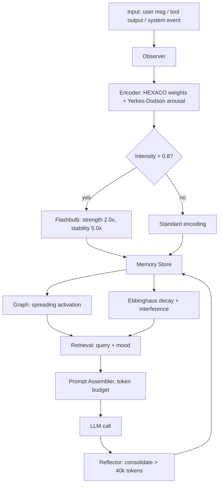
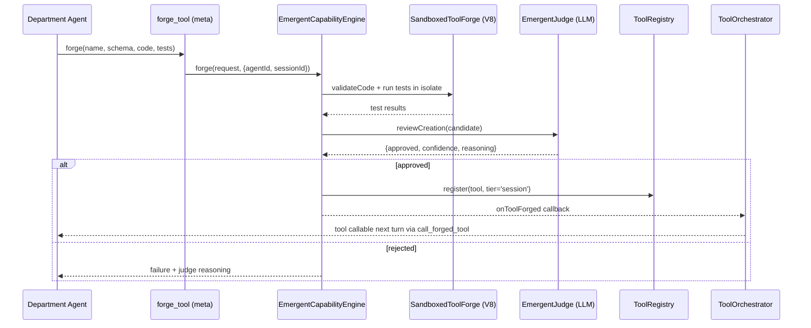

Mars Genesis is a six-turn, thirty-colonist civilization simulation that runs on AgentOS and Paracosm. Two AI commanders with opposing HEXACO personality profiles share an identical seed, an identical agent roster, and identical starting resources, and produce measurably different colonies by turn six. This post is the end-to-end case study: turn-by-turn, what the Engineer commander did, what the Visionary commander did, why their colonies diverged, and how to read the run artifact. A shorter comparison against the other major open-source multi-agent simulation framework (MiroFish) is appended at the end.

A representative moment from a recent run: turn three, year 2051. Dietrich Voss's chief medical officer faces a solar-storm radiation event that her existing toolbox doesn't cover. She doesn't pick an option from a menu. She writes a tool. The function is reviewed by an LLM judge, approved, executed in a sandbox, and returns a projected exposure number. Her commander reads that number three seconds later. By turn four every other department in the session can call the same tool for tens of tokens of dispatch. The runtime didn't script the path; it made the tool discoverable and the agents found it.

This post is the case study companion to [the long-form Paracosm launch post](/blog/paracosm-launch). The launch post is the structured-world-model framing and engine reference; this is the autopsy.

<video autoplay loop muted playsinline controls preload="metadata" poster="/img/blog/paracosm/digital-twin-atlas-lab-poster.jpg" style="width:100%;border-radius:8px;margin:1.5rem 0;">
  <source src="/img/blog/paracosm/digital-twin-atlas-lab-hero.mp4" type="video/mp4">
</video>

The video above is Atlas's lab walkthrough: the Engineer commander's path through the same six turns, captured from the dashboard. Pause it on turn three and you'll see the same radiation event resolve very differently than Maria's version.

## The moment a colonist writes a tool

Turn three. Year 2051. A solar storm rolls across the newly-settled Mars colony and the cumulative radiation dose for the outdoor crew crosses the threshold in the scenario's research packet. Dr. Priya Singh, the Chief Medical Officer in Dietrich Voss's colony, is the department agent assigned to analyze the event. She has HEXACO scores 0.88 Conscientiousness, 0.71 Emotionality, 0.42 Openness. She has three turns of consolidated memory about prior radiation incidents. She has exactly one meta-tool attached to her agent definition: `forge_tool`.

Her first move is not to pick an option from a menu. She looks at the already-forged toolbox. A `landing_site_suitability_index` from turn one does not apply. She writes a new tool.

She emits a JSON object describing a radiation dose calculator: an input schema, a sandboxed JavaScript function, three test cases, and an expected output shape. The function runs inside a hardened `node:vm` context with a 5 s wall-clock timeout, a 128 MB nominal memory budget, a default-empty API allowlist for `fetch`/`fs`/`crypto`, and statically-banned access to `eval`, `require`, `import`, `process`, `child_process`, and destructive `fs.*` operations. An [LLM-as-judge](https://arxiv.org/abs/2306.05685) reviews the code for safety and correctness. The verdict comes back approved, confidence 0.87. The calculator executes against her test cases and returns a projected exposure. That number lands in the report her commander reads three seconds later. By turn four the same tool is callable by every other department in the session without a second judge review, because a second meta-tool, `call_forged_tool`, dispatches to it directly.

This is the interior of [Mars Genesis](https://paracosm.agentos.sh), the reference scenario for [Paracosm](https://paracosm.agentos.sh), an AI agent swarm simulation engine built on [AgentOS](https://agentos.sh). The rest of this post is the case study. Two commanders with opposing HEXACO profiles run the same seed, and their colonies diverge in ways the deterministic kernel alone cannot explain.

## Two commanders, one seed

The scenario defaults to six turns across thirty-two years, 2035 to 2067, with a starting population of thirty. The seed is 950. The two default leaders have opposing HEXACO profiles:

- **Aria Chen, the Visionary.** Openness 0.95, Conscientiousness 0.35, Extraversion 0.85, Agreeableness 0.55, Emotionality 0.30, Honesty-Humility 0.65. Leads from the front with public comms; favors novel approaches; accepts casualties for strategic gain.
- **Dietrich Voss, the Engineer.** Openness 0.25, Conscientiousness 0.97, Extraversion 0.30, Agreeableness 0.60, Emotionality 0.70, Honesty-Humility 0.90. Works through technical channels; demands evidence before committing; reports failures transparently.

The kernel is deterministic. Given identical seed, identical roster, identical starting resources, it produces identical numerical outcomes per decision. What diverges is every language model call in between. Nine stages per turn, five of them LLM-driven, four deterministic:

```
1. EVENT DIRECTOR      LLM   Observes state, generates events
2. KERNEL ADVANCE      det.  Aging, births, deaths, resource deltas
3. DEPARTMENT ANALYSIS LLM   Each dept may forge or reuse a tool
4. COMMANDER DECISION  LLM   Reads all reports, picks an option
5. OUTCOME             det.  Seeded RNG + option risk probability
6. EFFECTS             det.  Colony deltas via the EffectRegistry
7. AGENT REACTIONS     LLM   Every alive agent reacts in parallel
8. MEMORY              det.  Short-term consolidates, stances drift
9. PERSONALITY DRIFT   det.  HEXACO traits shift under three forces
```

Two runs on the same seed produce identical stages 2, 5, 6, 8, 9 at the numerical level. The LLM stages diverge because every prompt carries the leader's HEXACO profile and the accumulated state it has shaped. The asymmetry is the entire point. This post goes into how the three cognitive systems (personality, mood, memory) and two economic systems (forge, reuse) combine to make the Visionary's run read differently from the Engineer's even when their populations track nearly identically.

## Personality: six traits that do work

Every colonist in Paracosm carries a [HEXACO](https://hexaco.org/) profile: six trait values clamped to the range 0.05 to 0.95. The model is from [Ashton and Lee (2007)](https://psycnet.apa.org/record/2007-06785-003) and their [2014 review of the Honesty-Humility dimension](https://journals.sagepub.com/doi/abs/10.1177/1088868314523838). The six dimensions are Honesty-Humility, Emotionality, Extraversion, Agreeableness, Conscientiousness, and Openness.

The engine-side profile lives at `HexacoProfile` in [apps/paracosm/src/engine/core/state.ts](https://github.com/framersai/paracosm/blob/master/src/engine/core/state.ts). The framework-side profile lives at `HexacoTraits` in [packages/agentos/src/memory/core/config.ts](https://github.com/framersai/agentos/blob/master/packages/agentos/src/memory/core/config.ts). Paracosm passes the profile through to AgentOS every time a colonist is instantiated as a conversational agent, and from there the trait vector controls how the agent's memory behaves.

In [EncodingModel.ts](https://github.com/framersai/agentos/blob/master/packages/agentos/src/memory/core/encoding/EncodingModel.ts) each trait maps to an attention weight on one class of input feature:

```typescript
export function computeEncodingWeights(traits: HexacoTraits): EncodingWeights {
  const o = clamp01(traits.openness);
  const c = clamp01(traits.conscientiousness);
  const e = clamp01(traits.emotionality);
  const x = clamp01(traits.extraversion);
  const a = clamp01(traits.agreeableness);
  const h = clamp01(traits.honesty);

  return {
    noveltyAttention:     0.3 + o * 0.7,
    proceduralAttention:  0.3 + c * 0.7,
    emotionalSensitivity: 0.2 + e * 0.8,
    socialAttention:      0.2 + x * 0.8,
    cooperativeAttention: 0.2 + a * 0.8,
    ethicalAttention:     0.2 + h * 0.8,
  };
}
```

Dietrich's Chief Engineer weights procedural details more strongly than Aria's. Aria's Chief Medical Officer amplifies novelty more. The same speech from a commander lands at different encoding strengths in different crew. Over six turns the compounding produces measurable differences in what each colonist can recall about a crisis they all experienced together.

The commander's HEXACO also writes a decision-style block into the bootstrap prompt. Six axes, both poles, each cue naming a concrete downstream behavior rather than the trait label. Aria reads `You favor novel, untested approaches over proven ones; the unknown is an opportunity, not a threat` and `You lead from the front: public announcements, rallying speeches, visible command presence`. Dietrich reads `You demand evidence and contingency plans before committing; you would rather be slow and right than fast and wrong` and `You report failures transparently, accept blame, and refuse to spin bad outcomes`. The dept prompt gets a matching six-axis cue that shapes the report itself: assertive tone versus measured tradeoffs-first, data-certainty presentation, cross-department framing. Two dept heads with different profiles on the same event produce measurably different reports, not the same report with different adjectives.

### Personality drifts, with known coefficients

HEXACO is not fixed for the run. Each turn, every promoted colonist's traits shift under three named forces. The function lives at [apps/paracosm/src/engine/core/progression.ts](https://github.com/framersai/paracosm/blob/master/src/engine/core/progression.ts):

```typescript
for (const trait of HEXACO_TRAITS) {
  let pull = 0;
  // Leader pull: traits converge toward commander
  pull += (commanderHexaco[trait] - c.hexaco[trait]) * 0.02;
  // Role pull: department activates specific traits (Tett & Burnett 2003)
  if (activation[trait] !== undefined) {
    pull += (activation[trait]! - c.hexaco[trait]) * 0.01;
  }
  // Outcome pull: success or failure reinforces specific traits
  if (turnOutcome === 'risky_success' && trait === 'openness') pull += 0.03;
  // ...
  c.hexaco[trait] = clamp(c.hexaco[trait] + pull * timeDelta, 0.05, 0.95);
}
```

The role-pull coefficients come from [trait activation theory](https://scholarworks.iu.edu/dspace/handle/2022/24014), the Tett and Burnett (2003) account of how certain situations activate certain traits and pull an occupant's observable personality toward the role's demand profile. Paracosm encodes role archetypes for medical, engineering, agriculture, psychology, and governance, each with a target trait vector, and moves a colonist's traits toward the archetype by a capped fraction per year. Leader pull draws on workplace research about personality similarity and team cohesion. None of the coefficients are invented. They are small, documented inline with their sources, and they are the only nondeterminism in personality evolution across runs on the same seed.

## Mood: a running affect state with concrete consequences

Personality says who the colonist is. Mood says how they feel right now. Every AgentOS agent carries a [`GMIMood`](https://github.com/framersai/agentos/blob/master/packages/agentos/src/cognitive_substrate/IGMI.ts) value, one of eight states: neutral, focused, empathetic, curious, assertive, analytical, frustrated, creative. Each mood maps to a [Pleasure-Arousal-Dominance](https://en.wikipedia.org/wiki/PAD_emotional_state_model) vector in [CognitiveMemoryBridge.ts](https://github.com/framersai/agentos/blob/master/packages/agentos/src/cognitive_substrate/CognitiveMemoryBridge.ts):

```typescript
public getPadState(): PADState {
  switch (this.getMood()) {
    case GMIMood.FRUSTRATED: return { valence: -0.65, arousal: 0.6,  dominance: 0.2  };
    case GMIMood.CURIOUS:    return { valence: 0.35,  arousal: 0.45, dominance: 0.15 };
    case GMIMood.EMPATHETIC: return { valence: 0.55,  arousal: 0.15, dominance: 0.25 };
    // ...
  }
}
```

Mood does three concrete things. It shapes encoding strength through the [Yerkes-Dodson](https://en.wikipedia.org/wiki/Yerkes%E2%80%93Dodson_law) arousal curve, which peaks at moderate arousal and degrades at both ends. It triggers flashbulb encoding when emotional intensity exceeds 0.8, a phenomenon first described by [Brown and Kulik (1977)](https://psycnet.apa.org/record/1977-27787-001) for events like the Kennedy assassination and replicated for other high-salience events since. Flashbulb memories land in the store at 2x base strength and 5x stability, so they survive decay cycles that ordinary memories do not. And mood biases retrieval through mood-congruent recall: a frustrated agent preferentially retrieves memories tagged with negative valence.

The `SentimentTracker` in [cognitive_substrate/SentimentTracker.ts](https://github.com/framersai/agentos/blob/master/packages/agentos/src/cognitive_substrate/SentimentTracker.ts) runs across turns with either lexicon-based or LLM-based scoring, maintains a sliding window of sentiment, and emits events to the metaprompt system when it detects patterns like accumulating frustration or rising confusion. Those events can trigger self-reflection, tone adjustment, or a swap to a stronger model for the next response.

Mood reaches Paracosm through two channels. The agent-reactions step produces per-colonist sentiment from the turn's events. The mood roll-up then feeds aggregate affect back into the next Event Director prompt. A scared colony sees different events than a hopeful one. Aria's Extraversion-0.85 rationale produces a more decisive public tone, which the mood roll-up reads as focused and determined. Dietrich's Extraversion-0.30 rationale reads as measured. The Event Director on the next turn picks events that test each colony's apparent readiness profile, which is why the same seed produces a solar storm for Aria and a perchlorate contamination suspicion for Dietrich at turn two.

## Cognitive memory: the pipeline

Memory is where personality and mood become durable. AgentOS's cognitive memory manager ([CognitiveMemoryManager.ts](https://github.com/framersai/agentos/blob/master/packages/agentos/src/memory/CognitiveMemoryManager.ts)) coordinates six subsystems. The pipeline:



Three pieces are worth pulling apart.

**Encoding is personality-modulated.** `computeEncodingStrength` in [EncodingModel.ts](https://github.com/framersai/agentos/blob/master/packages/agentos/src/memory/core/encoding/EncodingModel.ts) combines HEXACO-derived attention weights with a Yerkes-Dodson arousal multiplier, a mood-congruence boost, and flashbulb detection. Same input, different traits, different moods: different memory traces. That is the requirement for a memory system that claims to model humans instead of describing a featureless buffer.

**Retrieval is graph-aware.** The memory store sits behind either [Graphology](https://graphology.github.io/) or a custom KnowledgeGraph backend. On a query, the system runs classical similarity retrieval over the store and walks the graph for [spreading activation](https://psycnet.apa.org/record/1972-10293-001), the mechanism Collins and Quillian (1969) described and Anderson's [ACT-R](http://act-r.psy.cmu.edu/) architecture formalized. A recent memory tagged "storm" pulls in older memories tagged the same way even when embedding similarity alone would not surface them. [Hebbian co-activation](https://en.wikipedia.org/wiki/Hebbian_theory) strengthens edges between co-retrieved nodes, so graph traversal improves the longer a session runs.

**Forgetting is real.** Memories decay by an [Ebbinghaus](https://en.wikipedia.org/wiki/Forgetting_curve) curve with interference detection. Traces below a strength threshold are soft-deleted. Flashbulb memories get 5x stability, so they stay. This is the cognitive-science analogue of why Dr. Singh will still remember the solar storm in turn six but not remember an unremarkable briefing from turn two.

When Paracosm turns a colonist into a chat-ready agent in [apps/paracosm/src/runtime/chat-agents.ts](https://github.com/framersai/paracosm/blob/master/src/runtime/chat-agents.ts), the full pipeline activates. The agent carries the HEXACO profile from the simulation, every reaction the colonist produced during the run gets seeded as a memory with tags and importance scores, the full colony roster loads as a separate high-importance memory block, and conversation runs through AgentOS's standard memory-assembled prompt path. A user asking "what happened during the storm" gets a reply whose content depends on which colonist they asked. Each colonist encoded the storm differently and the decay rates since have differed too.

## Emergent tool forging: the runtime loop

Dr. Singh's dose calculator is not a stored-procedure call. It is a tool that did not exist before turn three. The machinery is the `EmergentCapabilityEngine` in [EmergentCapabilityEngine.ts](https://github.com/framersai/agentos/blob/master/packages/agentos/src/emergent/EmergentCapabilityEngine.ts), fronted by the meta-tool `forge_tool` from [ForgeToolMetaTool.ts](https://github.com/framersai/agentos/blob/master/packages/agentos/src/emergent/ForgeToolMetaTool.ts).



Two modes are supported. **Compose mode** chains existing tools by input-to-output mapping; it is safe by construction because no novel code executes. **Sandbox mode** runs agent-written JavaScript inside a hardened [`node:vm`](https://nodejs.org/api/vm.html) context (preemptive memory limits via [`isolated-vm`](https://github.com/laverdet/isolated-vm) are a queued upgrade for the hosted multi-tenant tier; the current node:vm path shares the host heap so memory is observed via heap-delta telemetry rather than enforced). Defaults are a 5-second wall clock, a 128-megabyte nominal memory budget, and an empty API allowlist. `fetch` (domain-restricted), `fs.readFile` (path-restricted, 1 MB cap), and `crypto` (hash + HMAC only) are allowlisted individually; in the default config none of the three are present. Static validation in `SandboxedToolForge.validateCode` rejects known-dangerous patterns (`eval`, `Function`, `require`, dynamic `import`, `process`, `child_process`, destructive `fs.*`) before a byte of code runs.

The forge pipeline is strict about one thing: every forged tool has an input schema, an output schema, and one or more test cases. The schemas are declared on the meta-tool itself (see `inputSchema` in [ForgeToolMetaTool.ts](https://github.com/framersai/agentos/blob/master/packages/agentos/src/emergent/ForgeToolMetaTool.ts)), so the model has to emit a self-describing tool rather than a bare function. At the framework level, where AgentOS requests a structured payload from the model, [api/generateObject.ts](https://github.com/framersai/agentos/blob/master/packages/agentos/src/api/generateObject.ts) uses a [Zod](https://zod.dev/) schema; invalid JSON triggers a retry with the validation error appended to the conversation so the model can self-correct. The forge loop uses declared test cases as the correctness check rather than a pure schema match, because schema validity alone does not prove a calculator calculates.

On judge approval the tool registers at the `session` tier with a 50-tool ceiling per run. The optional `onToolForged` callback fires at the same moment, wiring the new tool into the host's `ToolOrchestrator` and into a shared executable map. In Paracosm this happens inside the same turn, which is why Dr. Singh's calculator is callable by the Chief Engineer on the next department analysis. After five uses at confidence 0.8 or higher the promotion panel runs. On panel approval, the tool moves to the `agent` tier and survives beyond the session.

### The reuse economy: call_forged_tool

`forge_tool` is only half the loop. The other half is `call_forged_tool`, a meta-tool that lets a department in a later turn execute an already-approved forge on new inputs. No second judge review, no re-forging, no re-allocating sandbox time. A dose calculator approved on turn three returns a fresh number on turn four when the situation calls for it.

The machinery is small. The `onToolForged` callback pushes every approved tool's executable into a shared `Map<string, ITool>`. The `call_forged_tool` meta-tool closes over that map and dispatches by name. Every department sees an ALREADY-FORGED TOOLS block in its system context listing the current session inventory with last outputs, and the HEXACO-aware system prompt tells each profile when to reach for reuse versus when to forge fresh.

Personality drives the ratio, though not the way a surface reading of HEXACO would predict. A live six-turn run on the default seed produced three unique tools per side, same toolbox width. The asymmetry showed up in what happened AFTER a forge: Aria's Visionary profile accepted first-pass tools and invoked them ten times across the run via `call_forged_tool`. Dietrich's Engineer profile, with Conscientiousness 0.97, held tools to a higher evidence bar, and one of his three forges failed the judge outright. He reforged three times. He reused seven times. The Engineer demands perfection and rebuilds; the Visionary accepts good-enough and extracts more value from the tools he has.

Cost follows. A fresh forge costs a judge LLM call plus sandbox execution; a reuse via `call_forged_tool` costs essentially nothing. A rejected forge still costs the judge review, and the reforge that follows costs another. So the Engineer's perfectionism is visibly more expensive per run: more judge reviews, more sandbox executions, the same or fewer productive tool outputs downstream. The Visionary's looser standards produce comparable analytical coverage for less API spend. The dashboard's cost breakdown modal makes this visible: judge spend is the single largest share of a typical run, which is why the forge-and-reuse economy is the biggest lever on total cost.

### Do skills auto-pick up forged tools?

Within a process and session, yes, via the `onToolForged` callback plus `call_forged_tool`. The tool is immediately callable by every agent sharing that orchestrator for the rest of the run.

Across processes and sessions, no, not automatically. The bridge is one-way and explicit. The `SkillExporter` in [emergent/SkillExporter.ts](https://github.com/framersai/agentos/blob/master/packages/agentos/src/emergent/SkillExporter.ts) converts a promoted `EmergentTool` into the standard SKILL.md plus CAPABILITY.yaml format the `SkillLoader` and capability scanner already consume. Once exported to disk, the next process that starts up loads the forged skill alongside hand-authored ones. To ship a tool as a first-class capability in AgentOS, publish it through [@framers/agentos-extensions](https://github.com/framersai/agentos-extensions), which handles manifest, versioning, and load order. The trade-off is intentional: automatic within a session so agents solve novel problems live, reviewable across processes so the persistent capability surface stays a human decision. For a deeper look at the forge machinery and the LLM-as-judge pattern adapted to code review, see [Emergent Tool Forging and HEXACO Leaders](/blog/inside-mars-genesis-ai-colony-simulation).

## Cost safety: demo caps, BYO keys, abort gates

Paracosm ships as open source and is hosted at [paracosm.agentos.sh](https://paracosm.agentos.sh) for public access. A visitor who opens the site and clicks Run burns LLM credits. Keeping that footprint predictable takes three guards wired into the runtime.

**Demo caps, toggled by environment.** When `PARACOSM_HOSTED_DEMO=true` is set on the host, every request without a session API key runs against the host's credentials under a clamped configuration: 6 turns (configurable via `PARACOSM_DEMO_MAX_TURNS`), 30 colonists, 3 active departments, and the cheapest model tier (OpenAI `gpt-5.4-nano`, Anthropic `claude-haiku-4-5`). The dashboard's Settings panel reflects this: the Turns and Population inputs lock with a `demo:N` label and unlock the moment a user pastes their own OpenAI or Anthropic key into the API Keys field. No code push required to flip caps, no mystery overrides at submit time.

**Per-IP rate limit, persistent.** One simulation per IP per day for demo-mode requests, tracked in a JSON file that survives pm2 restarts. Worst-case spend at the host's keys scales as roughly `$0.15 × unique_daily_IPs × 30 days`. Users who want more runs paste their own key and bypass the limit entirely.

**Abort gates.** When all SSE clients disconnect for longer than a 1500ms grace period, the server fires an AbortController that the runtime checks at every major call site: the Event Director, each department's parallel fan-out, the commander decision, the reaction step, and the Turn 0 promotions. At most one in-flight LLM call completes after a tab closes; the rest of the turn short-circuits with a `sim_aborted` SSE event. The dashboard renders an "Unfinished" badge when the user returns, with partial results preserved. A demo run abandoned mid-turn costs pennies, not whole dollars.

The full run breakdown is visible in the dashboard's cost modal, tagged by pipeline stage: director, commander, dept-by-name, judge, reactions. The largest share is the judge across forges, which is why the reuse economy matters so much to total cost.

## Case study: how turn two diverges

Turn one is deterministic in framing. Both Aria and Dietrich face the same Landfall milestone, the first permanent settlement decision. The Event Director returns a milestone payload; the kernel has not advanced. Both commanders pick Arcadia Planitia over the canyon rim, the safer plain over mineral-rich terrain.

Turn two is where the runs diverge. The Director this time is not anchored to a milestone. It reads the colony's post-Turn-1 state: Aria's commander rationale in a high-Extraversion register, Dietrich's in a measured technical-log register; the aggregate mood roll-up from every colonist's agent reaction; the list of already-forged tools; knowledge topics from the seed's research packet. It returns different events per side.

Aria draws a solar storm. Her Chief Engineer and Chief Medical Officer both forge new tools on the spot: a shielding compliance scorer, a solar storm radiation risk index. High-Openness leaders lean exploratory, and her dept heads have been pulled toward that profile by leader-pull across the first turn.

Dietrich draws a different event profile: his high-Conscientiousness commander bias steers the Director toward events that reward procedure and expose improvisation gaps. His dept heads forge tools to the same specifications Aria's do, but the evidence bar on each is higher. At least one forge in a typical Engineer run fails the judge's correctness check, forcing a reforge. His reports read tighter and more cautious than Aria's, but his judge spend is higher because the perfectionism costs API calls.

By turn three the aggregate forged-toolbox inventory has diverged. By turn six the runs have different survivor counts, different HEXACO drift profiles for promoted colonists, different prompt-cache hit rates because of how many distinct judge reviews each run fired. Open a chat panel against any colonist after both runs complete. A colonist on Aria's side carries memories encoded with high-novelty attention weights: they remember the solar storm in terms of what the team learned. A colonist on Dietrich's side remembers the contamination scare in terms of what protocols were updated. Same HEXACO underlying profile at birth; different memory content because the encoding strength for each input depended on the traits of the leader whose commands shaped their experience, and on the mood they were in when the event landed.

The dashboard's colony visualization clusters survivors into family pods, floats featured colonists into a top row with their HEXACO badges, and lays out a ghost layer for the deceased so attrition reads as the visible field of pod outlines thinning over turns. Click any tile to open the drilldown: HEXACO radar with the colony mean overlaid, mood trajectory across turns annotated with crisis titles, family tree with clickable spouse and children thumbnails, reaction quotes per turn, chat handoff straight into the Chat tab pre-selected. Forge events tint by leader side, so at a glance which column invented a tool on which turn is obvious without reading any text.

## Deaths have causes

Mortality in Paracosm is not a single age-stepped roll. The kernel simulates six independent causes and attributes each death to the specific one that killed the colonist. Natural causes fire for colonists over 60 on an age-stepped probability. Radiation cancer fires for colonists over 30 with cumulative exposure above 1000 mSv and escalates above 2000 and 3500. Starvation fires colony-wide when food reserves drop below one month; everyone shares the risk. Despair fires for colonists with psychological scores below 0.2 and is weighted by Emotionality, high-Em colonists feel isolation harder. Fatal fractures fire for Mars-born crew over 40 with bone density below 60 percent. Accidents fire at a small baseline, department-weighted so engineering and medical take more hazardous positions than governance.

Every death carries the cause as a string in the event stream. The stats bar renders the distribution inline as a chip: `DEATHS 8 (3 radiation · 2 accident · 1 despair / 5 age)`. The verdict LLM at the end of a run sees the per-leader breakdown and writes about the specific pattern, a Visionary whose crew died to accidents reads very differently from an Engineer whose crew died to despair. Partnerships form during progression when unpartnered adults have high HEXACO compatibility and morale clears a floor; births prefer partnered couples at triple the unpartnered rate; conditions clear at different rates depending on severity. The population dynamics are not props in the story. They are the story the HEXACO-driven decisions leave behind.

## Reproduce this yourself

Three steps. Five minutes if your network and `OPENAI_API_KEY` cooperate.

```bash
npm install paracosm
```

```ts
import { WorldModel } from 'paracosm/world-model';
import { marsScenario } from 'paracosm/mars';
import { getSwarm, swarmFamilyTree } from 'paracosm/swarm';

const wm = WorldModel.fromScenario(marsScenario); // bundled preset

const dietrich = await wm.simulate(
  {
    name: 'Dietrich Voss',
    archetype: 'The Engineer', // high Conscientiousness, low Openness
    unit: 'Colony Alpha',
    hexaco: { openness: 0.3, conscientiousness: 0.95, extraversion: 0.4, agreeableness: 0.6, emotionality: 0.5, honestyHumility: 0.8 },
    instructions: '',
  },
  { maxTurns: 6, seed: 950 },
);

const aria = await wm.simulate(
  {
    name: 'Aria Chen',
    archetype: 'The Visionary', // high Openness, low Conscientiousness
    unit: 'Colony Alpha',
    hexaco: { openness: 0.95, conscientiousness: 0.35, extraversion: 0.85, agreeableness: 0.55, emotionality: 0.3, honestyHumility: 0.65 },
    instructions: '',
  },
  { maxTurns: 6, seed: 950 }, // SAME seed
);

// Same starting roster (same seed) → divergence is leader-driven.
console.log('Dietrich final:', dietrich.finalState?.metrics, getSwarm(dietrich)?.population);
console.log('Aria final:', aria.finalState?.metrics, getSwarm(aria)?.population);
console.log('Aria family tree:', swarmFamilyTree(aria));
```

The artifact captures per-turn divergence: which decisions differed, which tools were forged in one run but not the other, which mortality causes hit. The dashboard renders a Compare-modal swarm-diff that highlights "alive in Dietrich's colony but not Aria's" and which colonists' moods diverged across the runs. Read the dashboard for the visual version. Read the artifact for the programmatic one.

## FAQ

**Is Mars Genesis the only scenario?** No. Mars Genesis is the *reference* scenario shipped with paracosm. The same kernel runs any scenario you can express in the five-bag JSON shape (`metrics`, `capacities`, `statuses`, `politics`, `environment`).

**Why HEXACO instead of Big Five?** HEXACO is the smallest set of dimensions that produces visibly distinct simulator behavior in our hands. Big Five works almost as well; the Lee & Ashton 2007 paper makes the case that Honesty-Humility deserves to be a separate axis, and the data backs that up. We added their sixth axis and the simulator got better.

**Are deaths actually deterministic?** Yes. Each death has a kernel-attributed cause (natural / radiation / accident / starvation / despair / fatal fracture) and the cause is recorded in the artifact. Same seed + same leader produces the same death sequence — every roll, every cause, every name. That's what makes the compare modal possible: divergence between two leaders is signal, not noise.

**If it's deterministic, isn't it just probability rolls dressed up?** Partially, and it's worth being honest about which is which. Three rolls are honest background noise: natural mortality past 60, the 0.003-per-turn role-weighted accident rate, and junior-to-senior promotion chances. Old people die independent of how the colony is doing. Engineers EVA more than governance staff regardless of commander. The workforce ages. The rest of the mortality table — starvation, despair, radiation cancer, fatal fracture — is gated on state that only exists because of cumulative LLM decisions. Starvation requires `foodMonthsReserve < 1.0`, which requires multiple resource-event failures or aggressive forge spending that drained power for hydroponics. Despair requires `psychScore < 0.2`, which requires grief cascades from earlier named deaths plus isolation. The probability is state-driven; the roll picks the named individual. The launch post's [Deterministic doesn't mean scripted](/blog/paracosm-launch#deterministic-doesnt-mean-scripted) section unpacks this in full.

**Why doesn't the kernel pick the narratively-right victim?** Architectural choice. The LLM lane never writes kernel state directly, and the kernel never asks an LLM a question — everything crosses the lane via typed JSON contracts. That rule is what makes replay work, and it's the same rule that prevents the kernel from singling out the engineer-who-chose-the-bypass for narrative cause-and-effect. Paracosm picks "100 cells get statistical agency conditioned on state" over "every cell gets individual narrative agency at roughly 100× the LLM spend." Bottom-up sims ([MiroFish](https://github.com/666ghj/MiroFish) on [OASIS](https://github.com/camel-ai/oasis), [Stanford Generative Agents](https://arxiv.org/abs/2304.03442)) make the other choice. Both are valid; they answer different questions.

**Can I run more than two commanders?** Yes. `runBatch({ scenario, leaders: [...], seed: ... })` runs N leaders against one scenario. The diff helper extends to N-way; the dashboard renders an N-column timeline.

**How much does a run cost?** A six-turn Mars Genesis run with default settings costs in the low tens of cents. Cost is dominated by forge proposals (many tokens) and judge approvals (separate model calls). Reuse of forged tools after turn three is the largest cost-flattening lever.

**What's "leader-pull" and how is it different from prompting?** Leader-pull is a kernel-encoded drift force that nudges department heads' HEXACO traits toward their commander's profile over turns. It's not a prompt, it's a numerical update applied at turn boundaries to the trait vectors the kernel uses for downstream decision biasing. Prompt-only personality dissolves under pressure; kernel-encoded personality survives across turns.

**Can I see the full artifact?** Yes. Every run writes a `RunArtifact` JSON object covering scenario, leader, seed, turns, decisions, forges, judge verdicts, mortality events, citations, and cost. The dashboard renders it; the schema is exported via Zod and re-exportable to JSON Schema for non-TypeScript consumers.

## Run your own

Paracosm ships as an npm package. The engine, compiler, dashboard, and the two built-in scenarios (Mars Genesis and Lunar Outpost) come with the install:

```bash
npm install paracosm
```

A scenario is a JSON file. You define departments (the specialist AI agents that will analyze each crisis), metrics (what gets tracked), labels (domain vocabulary), and setup defaults. The compiler turns that JSON into a runnable scenario by generating TypeScript hooks via LLM calls. Compilation costs roughly $0.10 once and is cached to disk.

```typescript
import { compileScenario } from 'paracosm/compiler';
import { runSimulation } from 'paracosm/runtime';

const scenario = await compileScenario(worldJson, {
  provider: 'anthropic',
  model: 'claude-sonnet-4-6',
});

const visionary = {
  name: 'Captain Okafor',
  archetype: 'The Innovator',
  unit: 'Station Beta',
  hexaco: { openness: 0.9, conscientiousness: 0.4, extraversion: 0.8, agreeableness: 0.5, emotionality: 0.3, honestyHumility: 0.6 },
  instructions: 'You lead by experimentation. Push boundaries.',
};
const engineer = {
  name: 'Captain Reyes',
  archetype: 'The Pragmatist',
  unit: 'Station Alpha',
  hexaco: { openness: 0.4, conscientiousness: 0.9, extraversion: 0.3, agreeableness: 0.6, emotionality: 0.5, honestyHumility: 0.8 },
  instructions: 'You lead by protocol. Safety margins first.',
};

const results = await Promise.all(
  [visionary, engineer].map((leader) =>
    runSimulation(leader, [], { scenario, maxTurns: 8, seed: 42 })
  )
);
```

Each `runSimulation` returns a Zod-validated `RunArtifact` with cost, forged tools, citations, final state, and the per-turn decision log. The dashboard renders two artifacts side-by-side; the API has no upper limit, so you can sweep ten or twenty leaders if you want.

For the no-code path, [paracosm.agentos.sh/sim](https://paracosm.agentos.sh/sim) runs the same engine in the browser with a one-click Mars Genesis demo. Default settings take the low tens of cents per six-turn run.

## Comparison: Mars Genesis vs MiroFish

Two open-source multi-agent simulation frameworks shipped in early 2026. Both descend from the [Generative Agents](https://arxiv.org/abs/2304.03442) lineage (Park et al., Stanford 2023). They answer different questions.

[**MiroFish**](https://github.com/666ghj/MiroFish) (54k GitHub stars) is a prediction engine. The user uploads a real-world seed (a news article, a policy draft, a financial signal). MiroFish extracts entities into a [Zep Cloud](https://www.getzep.com/) knowledge graph, generates MBTI-style agent profiles from each entity, and runs a Twitter / Reddit social-media simulation on [OASIS](https://github.com/camel-ai/oasis) with up to a million agents. A ReportAgent with retrieval tools synthesizes the post-simulation graph into a structured prediction report. The graph owns truth; agents update it; the report queries it. The emergence is *social*: information cascades, opinion polarization, herd behavior.

**Mars Genesis** is a counterfactual-history engine. The user configures two commanders with continuous HEXACO trait vectors (not categorical MBTI types) and runs both through the same six-turn deterministic kernel from an identical seed. A deterministic kernel ([Mulberry32 PRNG](https://en.wikipedia.org/wiki/Multiply-with-carry_pseudorandom_number_generator)) owns canonical state (population, deaths, resource production, career progression). AI agents own interpretation (crisis generation, department analyses, tool forging, commander decisions). The kernel applies decisions as bounded numerical effects. The emergence is *capability-driven*: forged tools persist within a session, personality drift compounds across turns, and the colony at turn six reflects what the leader decided rather than what was on the menu when the run started.

| Dimension | MiroFish | Mars Genesis |
|---|---|---|
| Owns truth | Knowledge graph | Deterministic kernel |
| Personality model | MBTI (categorical, static) | HEXACO (continuous, drift each turn) |
| Agent scale | Thousands to millions | ~107 per turn (commander + 5 departments + director + ~100 colonists) |
| Determinism | Stochastic | Seeded kernel + stochastic agents |
| Output | Prediction reports | Side-by-side civilization comparison |
| Stack | Python + Vue + Flask + Docker, file-system IPC | TypeScript single-process, in-process SSE streaming |
| Emergence mechanism | Social dynamics on a platform replica | Tool forging + personality drift + crisis generation |

What builders take from each: MiroFish's GraphRAG-as-ground-truth design is strong for prediction use cases where the seed is a real-world document. Mars Genesis's separation of deterministic kernel from AI interpretation makes the divergence claim testable, because the same seed under different leaders is the entire experiment. Both are open source. Both are past chatbot demos.

## What to read next

- [Paracosm launch post](/blog/paracosm-launch). The long-form essay on counterfactual world simulation as a category, plus the engine reference.
- [Announcing AgentOS](/blog/announcing-agentos). The runtime underneath.

Paracosm and AgentOS are open source. The Mars Genesis scenario ships as a default and runs on `npm install paracosm`, or hosted at [paracosm.agentos.sh](https://paracosm.agentos.sh) with a one-click demo. The engine doesn't care who leads the colony or which traits they carry. It cares how they decide, what they remember, what tools they forge, and how aggressively they reuse. Two leaders under the same seed produce different histories because those four questions resolve differently for each of them.
